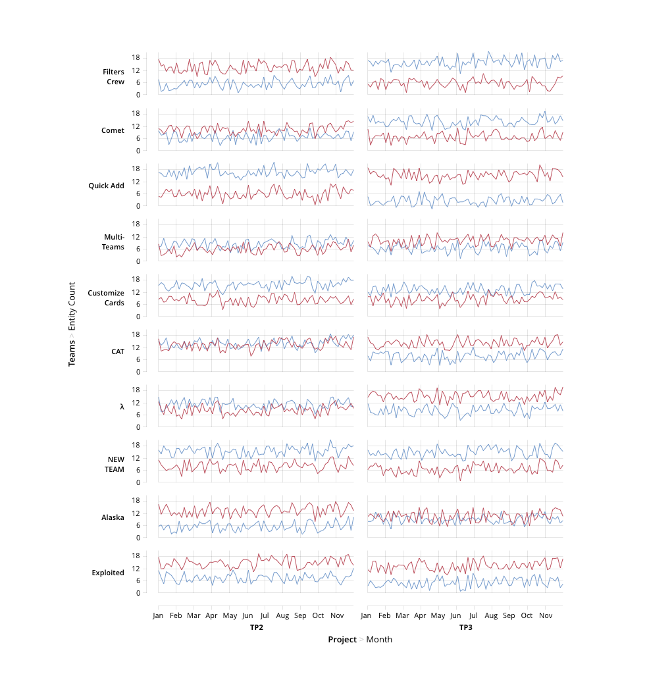

#What is a facet chart

The Grammar of Graphics provides the following description of the *facet* term:

> The facet implies a little face, such as one of the sides of an object (e.g., a cut diamond) that has many faces. The word is useful for describing an object that creates many little graphics that are variations of a single graphic. In a graphical system, facets are frames of frames. Because of this recursion, facets make frames behave like points in the sense that the center of a frame can be located by coordinates derived from a facet. Thus we can use facets to make graphs of graphs or tables of graphs

Simply speaking, in TauCharts facet charts group variables using X and Y coordinates. Facet charts help to compare information with many variables. You can use various combinations of axes to have just a single row: Y, X, X or a single column: Y, Y, X.

Here is an example of a facet chart. As you see, there are 4 variables encoded using X and Y coordinates. First, on Y axis we see Teams and every small chart Y axis shows how many entities each team completed. X axis shows projects (TP and TP3) and then months.


## Easy approach for creating facet chart.
To create facet chart you can pass array of dimension in x or y properties to chart spec.
Also you can set [guide properties](guide.md), if you pass array instead object.
All passed params will read with tail of array and convert to [Tau Chart language](../advanced/tauchartslanguage.md).
> Current moment you can't use two measure dimension for one axis. In this case you get error.

```javascript
     var chart = new tauChart.Chart({
         type: 'scatterplot',
         x: ['euroEco', 'co2'],
         y: ['power', 'hp'],
         dimensions: {
             car: {
                 type: 'category'
             },
             euroEco: {
                 type: 'category'
             },
             power: {
                 type: 'order',
                 order: ['low', 'normal', 'high']
             },
             co2: {
                 type: 'measure'
             },
             hp: {
                 type: 'measure'
             }
         },
         guide: [{
             split: false,
             padding: {
                 l: 42,
                 b: 24,
                 r: 8,
                 t: 8
             },
             x: {
                 label: 'euroEco'
             },
             y: {
                 label: 'power'
             }
         }, {
             showGridLines: 'xy',
             padding: {
                 l: 52,
                 b: 42,
                 r: 8,
                 t: 8
             },
             x: {
                 label: 'CO2 emission, g/km'
             },
             y: {
                 label: 'Horse power'
             }
         }],
         data: [{
             car: "Toyota Prius+",
             co2: 96,
             hp: 99
         }, {
             car: "Volvo S60",
             co2: 135,
             hp: 150
         }, {
             car: "BMV X5",
             co2: 197,
             hp: 306
         }, {
             car: "Infinity FX",
             co2: 238,
             hp: 238
         }, {
             car: "Mercedes Vito",
             co2: 203,
             hp: 95
         }, {
             car: "Peugeot 3008",
             co2: 155,
             hp: 120
         }, {
             car: "Subaru Forester",
             co2: 186,
             hp: 150
         }, {
             car: "Lexus RX",
             co2: 233,
             hp: 188
         }, {
             car: "Bentley Continental",
             co2: 246,
             hp: 507
         }].map(function(x) {

             x.euroEco = (x.co2 < 140) ? 'eco' : 'non-eco';
             x.power = (x.hp < 150) ? 'low' : ((x.hp < 200) ? 'normal' : 'high');
             return x;

         })

     });
     chart.renderTo('#scatter');
```
[example jsBin](http://jsbin.com/xelewitiro/3/embed?output&height=500px)
## How to create a facet chart

To construct facets we should use coordinates recursively by embedding COORDS.RECT units inside each other.

## Example: Segmentation

In the following example we use facet chart to visualize distribution of car models among segments powerfull / eco-friendly. While detailed information on horse power and CO2 emission is still available for each segment.

```javascript
{
    dimensions: {
        car: {type: 'category'},
        euroEco: {type: 'category'},
        power: {
            type: 'order',
            order: ['low', 'normal', 'high']
        },
        co2: {type: 'measure'},
        hp: {type: 'measure'}
    },

    unit: {
        type: 'COORDS.RECT',
        guide: {
            split: false,
            padding: {l: 42, b: 24, r: 8, t: 8},
        },
        x: 'euroEco',
        y: 'power',
        unit: [
            {
                type: 'COORDS.RECT',
                guide: {
                    showGridLines: 'xy',
                    padding: {l: 52, b: 42, r: 8, t: 8},
                    x: {label: 'CO2 emission, g/km'},
                    y: {label: 'Horse power'}
                },
                x: 'co2',
                y: 'hp',
                unit: [
                    {type: 'ELEMENT.POINT'}
                ]
            }
        ]
    }
}
```

[example jsBin](http://jsbin.com/zodocuzeco/1/embed?output&height=500px)

Another example of faceted charts is [Scatterplot Matrices](../advanced/splom.md). Check them out.

