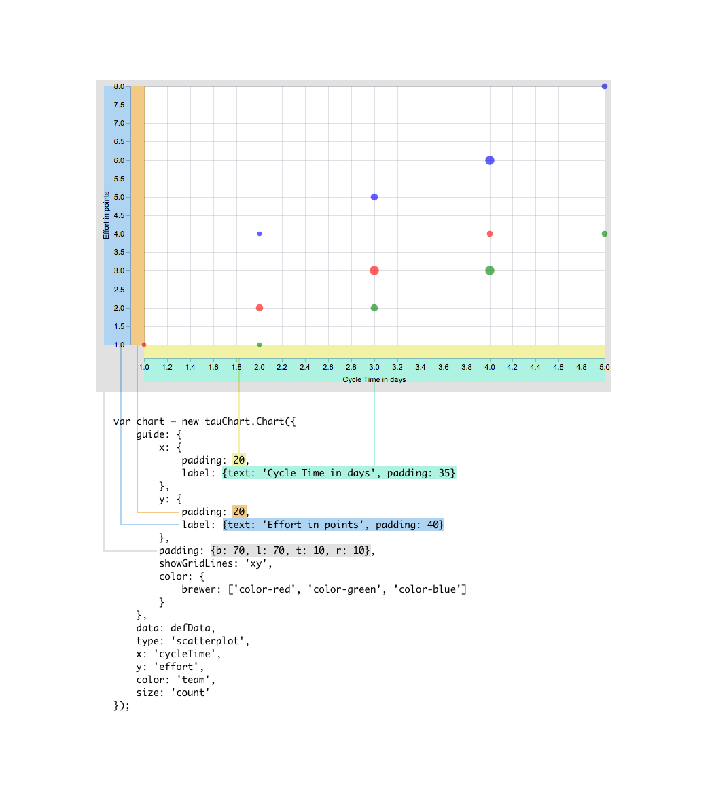

#Guide
Guide is responsible for axes look and feel: labels, paddings, color, size and other aesthetic parameters. Here is the structure of the chart and related settings:


And a live example:

```javascript
var chart = new tauChart.Chart({
    guide: {
        x: {label: {text: 'Cycle Time in days', padding: 35}, padding: 20},
        y: {label: 'Effort in points', padding: 20},
        padding: {b: 70, l: 70, t: 10, r: 10},
        showGridLines: 'xy',
        color: {
            brewer: ['color-red', 'color-green', 'color-blue']
        }
    },
    data: defData,
    type: 'scatterplot',
    x: 'cycleTime',
    y: 'effort',
    color: 'team',
    size: 'count'
});
```
[example jsBin](http://jsbin.com/focowi/1/embed?output&height=500px)

##Axis
x or y describes correspontent axis view. Text property is the axis title.
```javascript
  var guide = {
        x:{
           label: { text: 'Count', padding: 36 }
        }
  }
```

##Coordinate grid
If you want draw coordinates grid, you can set *showGridLines*:
```javascript
   var guide = {
        showGridLines:'xy' //show vertical and horizontal line
   }
   //show only x coordinate line
    var guide = {
           showGridLines:'x' //show vertical line
    }
    //or only y
    var guide = {
           showGridLines:'y' //show horizontal line
    }
```

##Color
See [encoding](../advanced/encoding.md#custom-colors-for-encoding-color-value) section to understand how to apply color.
