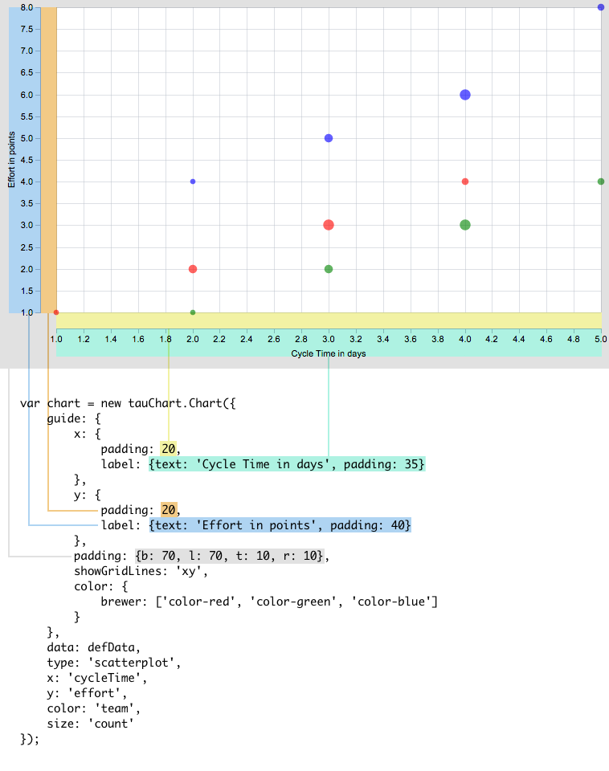

#Guide
Guide is responsible for axes look and feel: labels, paddings, color, size and other aesthetic parameters. Here is the structure of the chart and related settings:


And a live example:

```javascript
var chart = new tauCharts.Chart({
    guide: {
        x: {label: {text: 'Cycle Time in days', padding: 35}, padding: 20},
        y: {label: 'Effort in points', padding: 20},
        padding: {b: 70, l: 70, t: 10, r: 10},
        showGridLines: 'xy',
        color: {
            brewer: ['color-red', 'color-green', 'color-blue']
        }
    },
    data: defData,
    type: 'scatterplot',
    x: 'cycleTime',
    y: 'effort',
    color: 'team',
    size: 'count'
});
```
[example](http://jsfiddle.net/taucharts/ry010e5m/)

##Axis
x or y describes correspondent axis view. We set axis label to 'Count' and define a padding in pixels.
```javascript
  var guide = {
        x:{
           label: { text: 'Count', padding: 36 }
        }
  }
```

#### autoScale (*deprecated*)

This property is deprecated and will not be supported after 1.0.0 release. See *nice* below as an alternative.

#### nice

By default Taucharts engine tries to make axis scale "nice". It tries to start measure-based scale from 0 and adds some margins to complete scale with "nice" numbers. For example, if original scale domain contains values [8, 20, ... 40], then axis will have ticks from 0 to 45.

For the time scale *nice* means adding margins to start and complete scale with nearest nice dates.

You can avoid this behavior by setting axis guide property *nice* to false:

```javascript
guide: {
    x: { nice: false }
}
```

In this case axis ticks match borders of the original domain. For example, axis ticks will start from 8 and end with 40 for the sample domain [8, 20, ... 40].

#### min / max

The scale domain can be extended using *min* and *max* properties. The *min* and *max* can't reduce original scale domain and will be ignored in such a cases.

NOTE: the "nicing" will be applied to extended domain by default. Set *nice* property to *false* to avoid such a behavior.

For example, this approach can be used to setup percent scale (from 0 to 100) while there are no 0 or 100 values in the original data.

```javascript
data: [{date:"2016-01-01", percent:5} ... {date:"2016-02-22", percent:85}],
x: "date",
y: "percent",
guide: {
    y: { min: 0, max: 100, nice: false }
}
```
See example: https://jsfiddle.net/tnhfxnuc/

## Ticks

Ticks are small indicators on an axis that shows axis values.

#### tickFormat

*guide* allows to format tick labels using *tickFormat* property. TauCharts uses d3-based formatter. Check available [d3 format specifiers](https://github.com/mbostock/d3/wiki/Formatting#d3_format).

In the example below ticks on *x* axis are formatted using SI-prefix (e.g. "22000" printed as "22k").

```javascript
  var guide = {
        x:{ tickFormat: 's' }
  }
```
[Custom format specifiers](//api.taucharts.com/plugins/customticks.html#how-to-add-a-custom-tick-format) can be defined:
```javascript
// register formatter by a string key
tauCharts.api.tickFormat.add('string_key', function (originalValue) { /* formatter */ })
...
// then pass the key to the [tickFormat] property
{
    type: 'bar',
    ...
    guide: {
        x: { tickFormat: 'string_key' }
    }
}
```
Custom format specifiers are useful for ticks localization.

See example of such localization: http://jsfiddle.net/qvqn12zg/

#### tickPeriod

When operate with *period* scale, *guide* allows to specify the period size.

```javascript
  var guide = {
        x:{ tickPeriod: 'quarter', tickFormat: 'day' }
        // tickPeriod indicates that every tick is a quarter, while tickFormat sets how tick value will be displayed
        // In this example we will have quarters with first day of the quarter: 01-Jan-2014, 01-Apr-2014, 01-Jul-2014, 01-Oct-2014...
  }
```

```javascript
  var guide = {
        x:{ tickPeriod: 'quarter', tickFormat: 'quarter' }
        // Q4 2013, Q1 2014, Q2 2014, Q3 2014...
  }
```

There is a set of pre-defined periods:
- day
- week (split timeline by sundays)
- month
- quarter
- year

Also there is a set of *tickFormat*'s for time-based dimensions:
- "day" (12-Oct-2014)
- "week" (02-Nov-2014) - end date of week
- "week-range" (02-Nov-2014 - 09-Nov-2014) - dates range for the week
- "month" (January 2014, Febrary...) - display month name. January is displayed with a year on the right.
- "month-year" (January 2014, Febrary 2014...)
- "quarter" (Q2 2014)
- "year" (2014)

Also you can [define your own period and tick format](../plugins/customticks.md).

##Coordinate grid

If you want to draw a coordinates grid, you can set *showGridLines*:
```javascript
   var guide = {
        showGridLines:'xy' //show vertical and horizontal line
   }
   //show only x coordinate line
    var guide = {
           showGridLines:'x' //show vertical line
    }
    //or only y
    var guide = {
           showGridLines:'y' //show horizontal line
    }
```

##Color
See [encoding](../advanced/encoding.md#custom-colors-for-encoding-color-value) section to understand how to apply color.
